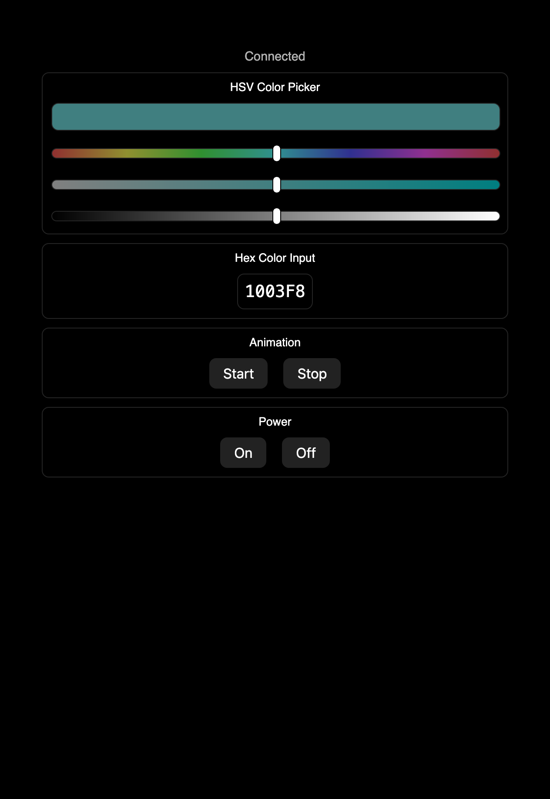

A scrappy lighting solution that I made for my room using neopixels and an esp8266. Supports
low-latency control over the lights using websockets, and uses local storage to save/load state
when the light switch gets flipped on/off.

